#캡스톤디자인 안드로이드앱프로그래밍

## 1주차

## 2주차
 - Github 사용법
 - 안드로이드 프로그래밍 시작
    - Toast 알림
    - AVD 시작하기
    
    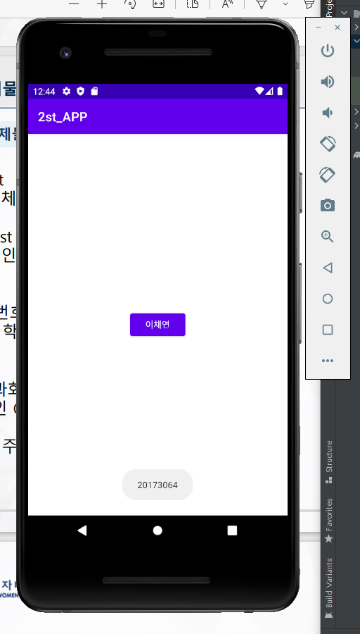</img>
   
## 3주차
  - 네이버 창 띄우기
  - 전화걸기 창 띄우기 
  
  </img>
  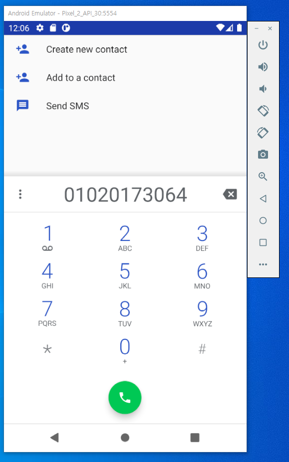</img>
   
## 4주차
- 아이디어 명: 옷 스캔하면 정보가 바로 나오는 앱
- 기획배경: 가끔 연예인, 유튜버 등 영향력이 있는 사람들이 입고 나온 옷에 대한 정보를 모를 경우가 많다. 

## 5주차
- 이미지 바꾸기 
 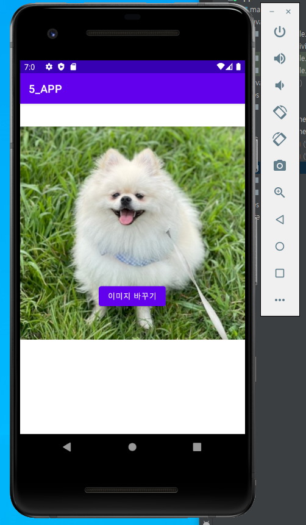</img>
  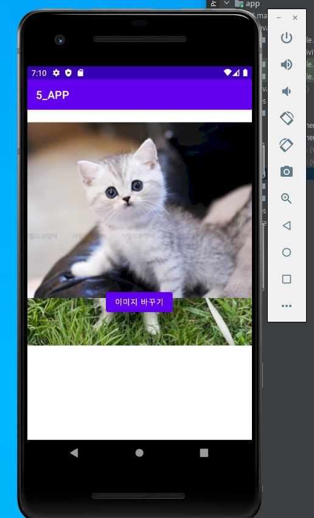</img>
## 6주차
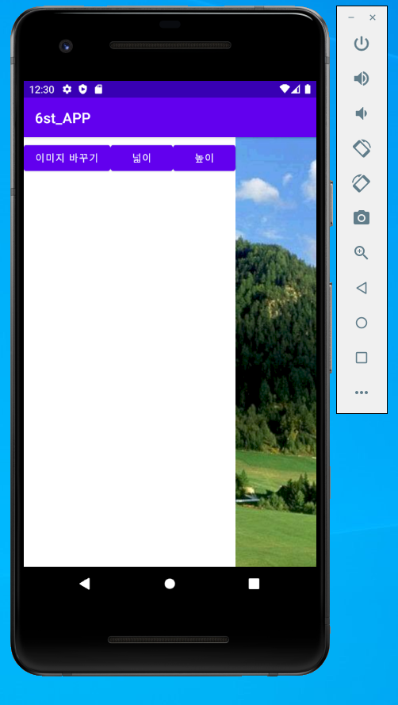</img>
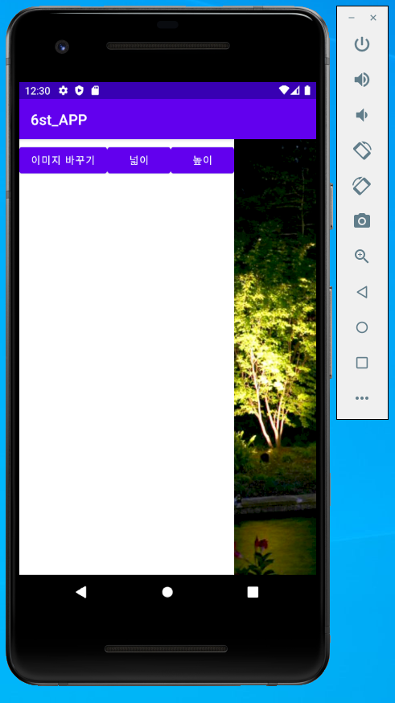</img>
## 9주차
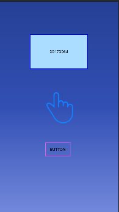</img>
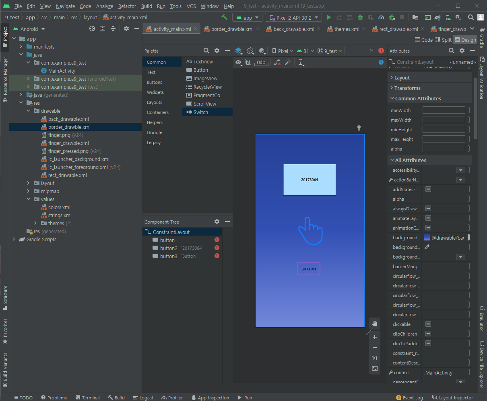</img>
## 10주차 
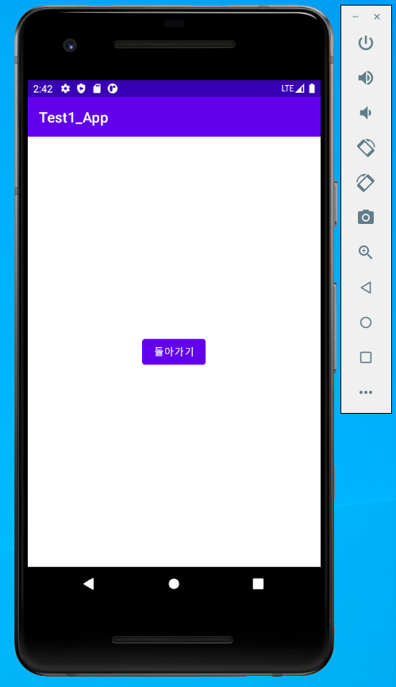</img>
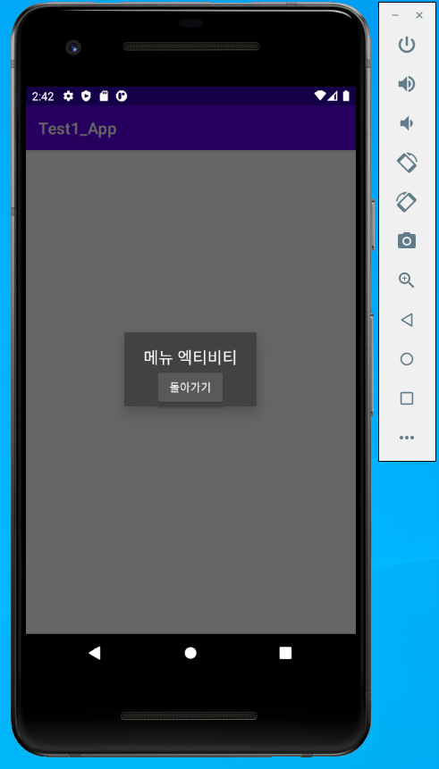</img>
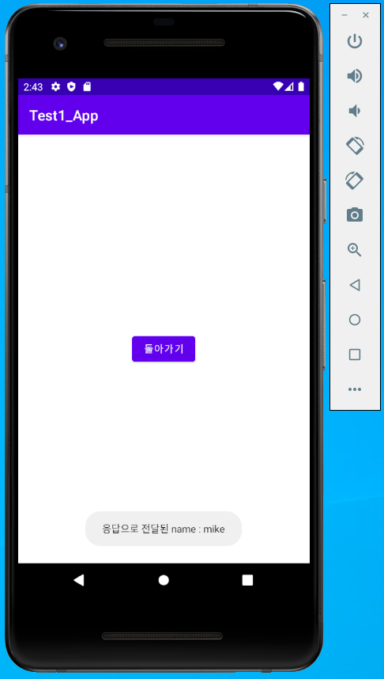</img>
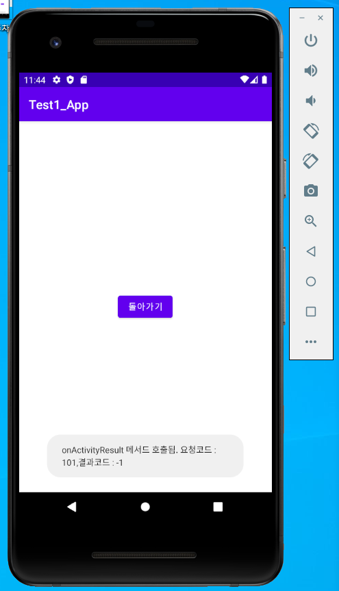</img>
## 11주차
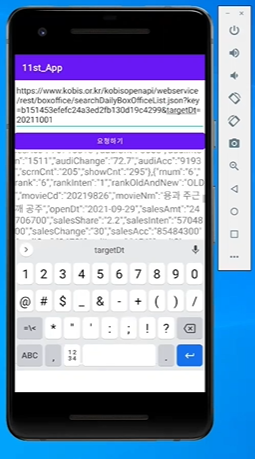</img>
  
